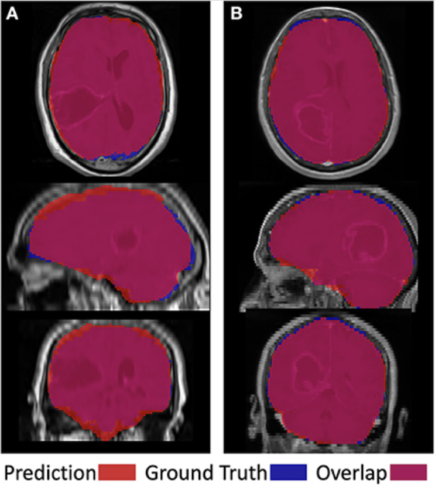

# MRI SkullStripping Using NiftyNet

## Introduction

MRI skull stripping is an important component of MRI preprocessing that needs to happen prior to any followup analysis.
In this project, we assessed the performance of Dense-Vnet in skull stripping brain tumor patient MRI data from our in house image repository using a supervised learning approach. We trained the network using common MRI sequences in oncology: 
T1-weighted with gadolinium contrast, T2-weighted fluid-attenuated inversion recovery, or both. 

## Data
Data included pretreatment MRI of patients from our in-house multi-institutional brain tumor repository. We automatically 
genereted imperfect training labels by merging tissue probability maps of the output of SPM12 software (https://www.fil.ion.ucl.ac.uk/spm/software/spm12/).
Details of this process are provided in the reference bellow.

Due to the proprietary nature of patient data and patient information, we are not at liberty to freely share data.
However, data may be available for sharing upon the request of qualified parties if patient privacy and intellectual property 
interests of our institution are not compromised. For questions about data access please contact the MNO lab (https://mathematicalneurooncology.org).

## model training

We used TensorFlow (version 1.12.0) and the medical imaging deep learning platform NiftyNet (https://niftynet.readthedocs.io/en/dev/)
for implementation of all experiments. NiftyNet is a modularly structured deep learning platform tailored toward medical image analysis
applications with modules for preprocessing, network training, evaluation, and inference. Minimal coding is required from the user using
this platform, and the specific settings related to preprocessing images, training, and testing can be communicated via a configuration
file.

- Our config file is available in config/config.ini
- Trained models are available in models/  

## inference

### computational requirements for inference

It's slow, but it runs on a macbook pro last I checked.

### how to run inference

1. Prepare your data: 
To run inference, you will need to prepare your data in a certain way. As easy as working with niftynet is, it still is finiky about 
how the data is presented to it. You need to prepare a folder with your test case images in nifti format. Niftynet works in batches, 
so it can be a folder with all of your test cases or just one case. Images **NEED** to be tagged with a subtype identifier (T1, FLAIR, etc.)

2. Create the environment: Open a terminal window and cd into where this file is. Create the environment using the niftynet.yml file:

> conda env create -f niftynet.yml

> source activate niftynet

3. run the run_inference.py file. run_inference.py is a wrapper that takes care of all preprocessing that needs to happen before you can run the model on a new test case.
This script does: 

- finds all input images and resamples and renames data to match what niftynet expects
- generates a csv file, in which new image ids are assigned to inference cohort (needed for running niftynet)
- generates a reference csv file for keeping track of name change and spacing change.
- writes a configation file for calling niftynet that include paths to input,
   output, model, etc.
- calls the niftynet platform using said config file in inference mode, this will generate predicted brain masks.
- renames and resizes predicted mask back to the original image space and image names
- deletes all intermediate files

Run it like this:

> python run_deepBrain.py -i <path_to_input_dir> -o <path_to_output_dir> -s <T1GD (or FLAIR)>

## Reference:

Ranjbar S et al. "Weakly Supervised Skull Stripping of Magnetic Resonance Imaging of Brain Tumor Patients". From Prototype to Clinical Workflow: Moving Machine Learning for Lesion Quantification into Neuroradiological Practice. 2022 Aug 2. [Link](https://books.google.com/books?hl=en&lr=&id=UtJ-EAAAQBAJ&oi=fnd&pg=PA113&dq=Weakly+Supervised+Skull+Stripping+of+Magnetic+Resonance+Imaging+of+Brain+Tumor+Patients&ots=hU2BNUFe5V&sig=thj2f80jYcQeTYY_S0VXkL1C9KE#v=onepage&q=Weakly%20Supervised%20Skull%20Stripping%20of%20Magnetic%20Resonance%20Imaging%20of%20Brain%20Tumor%20Patients&f=false)

